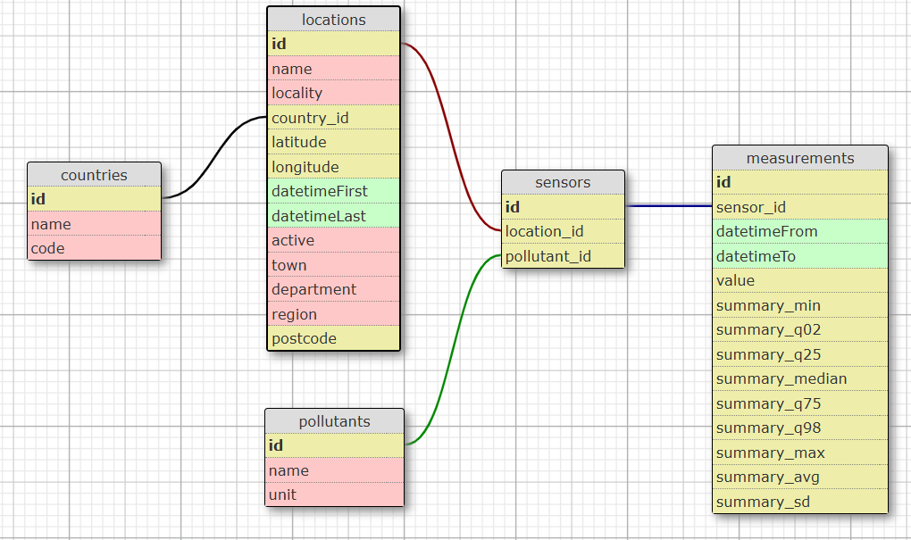

# 🌍 Air Pollution Dashboard

Visualize air pollution data (PM2.5, PM10, NO2, etc.) in France through an interactive [dashboard](https://air-pg.streamlit.app).

In a nutshell:
- User filter by **pollutant**, **date range**, and **geographical location** (town, department, region).
- Dashboard show **pollution trends** and compare localities by **pollution levels**, **air quality improvements**, and **sensors** installation.

---
### 🎯 **How it works ?**

**💻 Data Collection & ETL Pipeline (API → PostgreSQL)**:
1.  Collected data via API requests.
2.  Data cleaned and transformed.
3.  Creation, insertion, and hosting of a PostgreSQL database.

**📊 Data Querying & Visualization (PostgreSQL → Interactive Dashboard)**:
1.  Querying data from the PostgreSQL database.
2.  Data transformation according to user filters.
3.  Creation of interactive visualizations in a web dashboard.

---
### ⚙️ Tech Stack

This project uses the following tools and libraries:

- **httpx**: To fetch data from the OpenAQ API.
- **PostgreSQL**: For storing and managing datasets.
- **Pandas**: For data manipulation and analysis.
- **Plotly**: To create interactive visualizations.
- **Streamlit**: To build a **user-friendly** interactive dashboard.
- **Supabase**: To host and manage the PostgreSQL database on the cloud.

---

**Database Schema**

   

---

**Example of initial filters:**
   

**Example of applied filters with graph:**
   

---

### 🔗 Demo

Check out the live **Air Pollution Dashboard** [here](https://air-pg.streamlit.app).

---

### 🗂️ Data

The data for this project comes from the **OpenAQ API**, which is:

- **Open Source** and **Non-profit**.
- Provides pollution data in **physical units** (not air quality index).
- Covers a wide range of pollutants: **PM2.5, PM10, SO2, NO2, CO, O3**.

For more details, visit [OpenAQ](https://docs.openaq.org/about/about).

---
